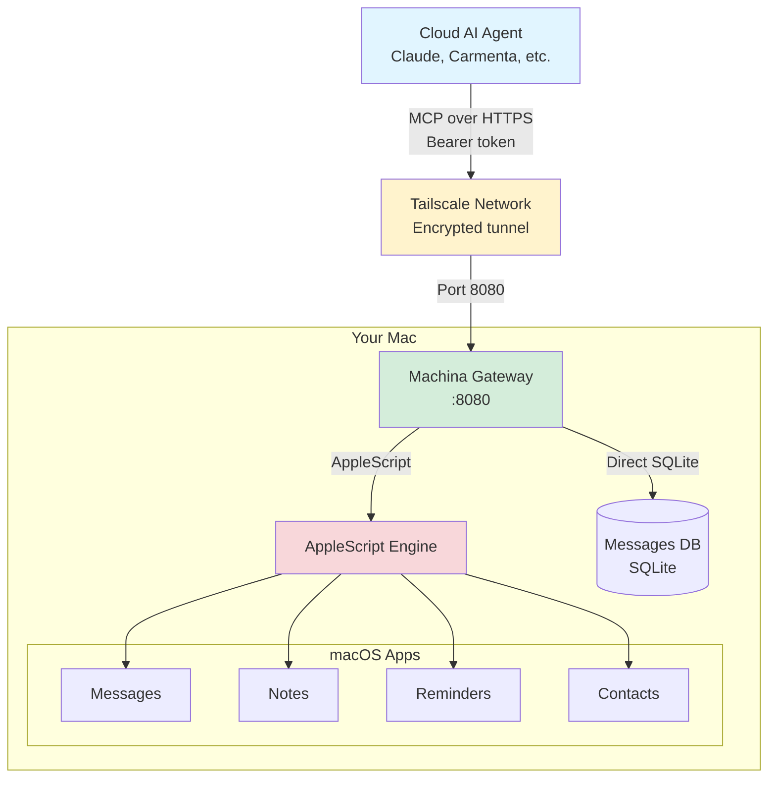

# Machina

**AI's home on your Mac.**

Give AI agents remote access to iMessage, Notes, Reminders, Contacts, and more. Installed and maintained by Claude Code - not bash scripts.

```
Cloud AI ──MCP over HTTP──▶ Machina ──▶ Your Mac's capabilities
```

## The Problem

AI agents can think, reason, and plan - but they can't act. They can't send you an iMessage. They can't check your calendar. They can't control your Mac.

Existing solutions are fragmented: separate MCP servers for each capability, local-only access, traditional installers that break on edge cases.

## The Solution

Machina provides:

- **MCP Gateway** - Standard MCP server exposing all Mac capabilities
- **Remote Access** - Cloud AI agents can reach your Mac via Tailscale
- **AI-Native Installation** - Claude reads the knowledge, adapts to your system, installs everything
- **Self-Maintaining** - Automated updates, health checks, auto-recovery

## Installation

### Prerequisites

**You need:**

1. **macOS** (Apple Silicon or Intel)
2. **[Tailscale](https://tailscale.com)** - Sign up and install (free tier works)
3. **[Claude Code](https://claude.ai/code)** - The AI-native installer

**Optional:**

- Homebrew (Claude will install if needed)
- Bun (Claude will install if needed)

### Quick Start

```bash
# 1. Clone the repo
git clone https://github.com/TechNickAI/machina ~/machina
cd ~/machina

# 2. Start Claude Code
claude
```

Then say: **"Set up machina"**

Claude will:

1. ✅ Verify prerequisites (Tailscale, macOS version)
2. 🔐 Trigger all permission prompts at once (approve them all)
3. 📦 Install Bun and dependencies
4. 🔑 Generate authentication token
5. 🚀 Start the MCP gateway
6. 🌐 Configure Tailscale HTTPS access
7. 🧪 Test with actual iMessage/Notes queries
8. 📋 Give you an MCP config to copy/paste

**That's it.** 5-10 minutes. No bash scripts. No debugging. Claude adapts to your system.

## The AI-Native Installer

This is Machina's key innovation.

Traditional installers follow deterministic steps and break on edge cases. Machina's `knowledge/` folder contains goals and verification criteria. Claude reads it, understands the goal, assesses your system, adapts, and achieves the desired state.

| Traditional Installer             | AI-Native Installer          |
| --------------------------------- | ---------------------------- |
| Assumes deterministic environment | Adapts to your actual system |
| Breaks on edge cases              | Debugs and fixes issues      |
| User googles errors               | Claude resolves errors       |
| One-size-fits-all                 | Asks what you want           |

**Why this works:**

- Claude can assess: "Is Homebrew installed? What permissions are granted?"
- Claude can adapt: "Bun not found - installing it first"
- Claude can debug: "AppleScript permission error - checking System Preferences"
- Claude can verify: "Sending test message to confirm iMessage works"
- Claude can ask: "Do you want WhatsApp? This requires QR authentication."

## Capabilities

| Capability | Implementation                                                  | Status     |
| ---------- | --------------------------------------------------------------- | ---------- |
| iMessage   | Direct SQLite + AppleScript                                     | ✅ Ready   |
| Notes      | AppleScript                                                     | ✅ Ready   |
| Reminders  | AppleScript                                                     | ✅ Ready   |
| Contacts   | AppleScript                                                     | ✅ Ready   |
| WhatsApp   | [whatsapp-mcp](https://github.com/lharries/whatsapp-mcp) bridge | 🚧 Planned |

All operations use the **progressive disclosure** pattern - one `machina` tool, operations discovered via `describe` action.

## Architecture



**Key points:**

- **Progressive disclosure:** One `machina` tool, operations discovered on-demand
- **Direct access:** SQLite for Messages (faster), AppleScript for others
- **Secure:** Tailscale encrypted tunnel + bearer token auth
- **Simple:** Single Bun process, no complex orchestration

## Updates

```bash
cd ~/machina && claude
```

Say: **"Update machina"**

Or trigger remotely via the HTTP API. Machina can also self-update on a schedule.

## Requirements

- macOS (Apple Silicon or Intel)
- [Claude Code](https://claude.ai/code)
- [Tailscale](https://tailscale.com) (for remote access)
- Willingness to grant Automation permissions

## Philosophy

> The knowledge folder IS the installer.

Machina embodies a new paradigm: AI-native software. Instead of writing bash scripts that break, we write knowledge that Claude reads and executes. Claude adapts, debugs, and verifies. Humans approve and oversee.

This pattern should spread. Fork this. Learn from it. Apply it to your own projects.

## License

MIT

---

Built for [Carmenta](https://github.com/TechNickAI/carmenta) - AI that actually cares.
