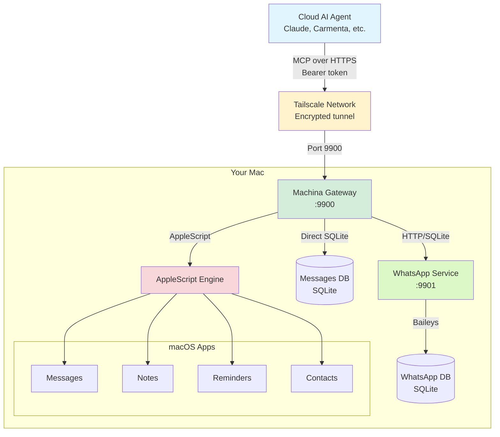

<p align="center">
  
</p>

[](https://www.apple.com/macos/)
[](https://www.typescriptlang.org/)
[](https://modelcontextprotocol.io/)
[](https://github.com/TechNickAI/machina/releases)
[](https://claude.ai/code)

# Machina

**AI's home on your Mac.**

Give AI agents remote access to iMessage, Notes, Reminders, Contacts, and more. Installed and maintained by Claude Code - not bash scripts.

```
Cloud AI ──MCP over HTTP──▶ Machina ──▶ Your Mac's capabilities
```

## The Problem

AI agents can think, reason, and plan - but they can't act. They can't send you an iMessage. They can't check your calendar. They can't control your Mac.

Existing solutions are fragmented: separate MCP servers for each capability, local-only access, traditional installers that break on edge cases.

## The Solution

Machina provides:

- **MCP Gateway** - Standard MCP server exposing all Mac capabilities
- **Remote Access** - Cloud AI agents can reach your Mac via Tailscale
- **AI-Native Installation** - Claude reads the knowledge, adapts to your system, installs everything
- **Self-Maintaining** - Automated updates, health checks, auto-recovery

## Installation

### Prerequisites

**You need:**

1. **macOS** (Apple Silicon or Intel)
2. **[Tailscale](https://tailscale.com)** - Sign up and install (free tier works)
3. **[Claude Code](https://claude.ai/code)** - The AI-native installer

**Optional:**

- Homebrew (Claude will install if needed)
- Node.js 22+ (Claude will install if needed)

### Quick Start

**Important:** Run this setup from the Mac's Terminal app or via VNC, not over SSH. macOS permission prompts require GUI access.

```bash
# 1. Clone the repo
git clone https://github.com/TechNickAI/machina ~/machina
cd ~/machina

# 2. Start Claude Code (bypass mode required for automation)
claude --permission-mode=bypassPermissions
```

Then run: **`/machina`**

Claude will:

1. ✅ Verify prerequisites (Tailscale, macOS version, Node.js)
2. 🔐 Trigger all permission prompts at once (approve them all)
3. 📦 Install dependencies
4. 🔑 Generate authentication token
5. 🚀 Start the MCP gateway
6. 🌐 Configure Tailscale HTTPS access
7. 🧪 Test with actual iMessage/Notes queries
8. 📋 Give you an MCP config to copy/paste

**That's it.** 5-10 minutes. No bash scripts. No debugging. Claude adapts to your system.

## The AI-Native Installer

This is Machina's key innovation.

Traditional installers follow deterministic steps and break on edge cases. Machina's `knowledge/` folder contains goals and verification criteria. Claude reads it, understands the goal, assesses your system, adapts, and achieves the desired state.

| Traditional Installer             | AI-Native Installer          |
| --------------------------------- | ---------------------------- |
| Assumes deterministic environment | Adapts to your actual system |
| Breaks on edge cases              | Debugs and fixes issues      |
| User googles errors               | Claude resolves errors       |
| One-size-fits-all                 | Asks what you want           |

**Why this works:**

- Claude can assess: "Is Homebrew installed? What permissions are granted?"
- Claude can adapt: "Node.js not found - installing it first"
- Claude can debug: "AppleScript permission error - checking System Preferences"
- Claude can verify: "Sending test message to confirm iMessage works"
- Claude can ask: "Do you want WhatsApp? This requires QR authentication."

## Capabilities

| Capability | Implementation                                | Status   |
| ---------- | --------------------------------------------- | -------- |
| iMessage   | Direct SQLite + AppleScript                   | ✅ Ready |
| Notes      | AppleScript                                   | ✅ Ready |
| Reminders  | AppleScript                                   | ✅ Ready |
| Contacts   | AppleScript                                   | ✅ Ready |
| WhatsApp   | Baileys library + SQLite (optional, needs QR) | ✅ Ready |

All operations use the **progressive disclosure** pattern - one `machina` tool with dot-notation operations:

```
// Discover all available operations
machina(action='describe')

// Specific operation details
machina(action='describe', params={operation: 'whatsapp.send'})

// Execute an operation
machina(action='whatsapp.chats', params={limit: 5})
machina(action='messages.send', params={to: 'Mom', body: 'Hi!'})
```

## Architecture



**Key points:**

- **Progressive disclosure:** One `machina` tool, operations discovered on-demand
- **Direct access:** SQLite for Messages/WhatsApp (faster), AppleScript for others
- **Secure:** Tailscale encrypted tunnel + bearer token auth
- **Simple:** Single Node.js process + optional WhatsApp service

## Updates

```bash
cd ~/machina && claude --permission-mode=bypassPermissions
```

Run: **`/machina`** (same command - it detects you're already installed and checks for updates)

Or trigger remotely via the `system_update` MCP operation.

## Requirements

- macOS (Apple Silicon or Intel)
- [Claude Code](https://claude.ai/code)
- [Tailscale](https://tailscale.com) (for remote access)
- Willingness to grant Automation permissions

## Philosophy

> The knowledge folder IS the installer.

Machina embodies a new paradigm: AI-native software. Instead of writing bash scripts that break, we write knowledge that Claude reads and executes. Claude adapts, debugs, and verifies. Humans approve and oversee.

This pattern should spread. Fork this. Learn from it. Apply it to your own projects.

## License

MIT

---

Built for [Carmenta](https://github.com/TechNickAI/carmenta) - AI that actually cares.
